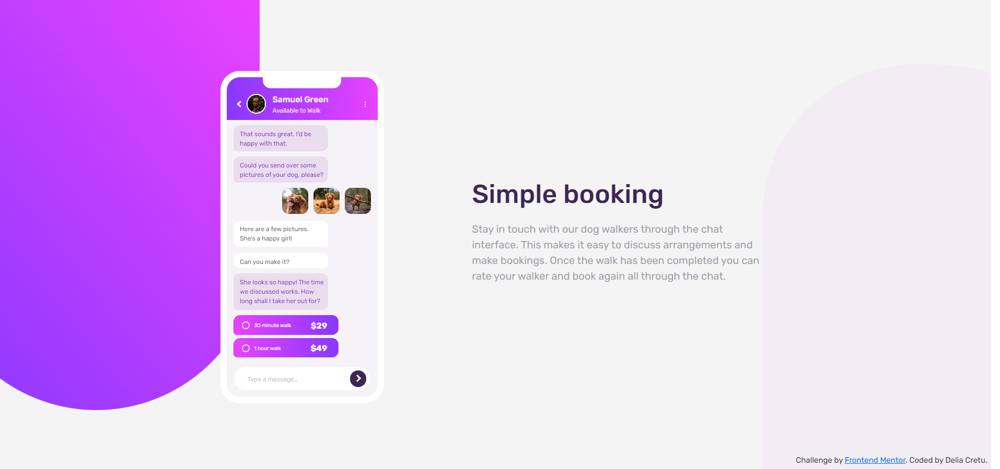

# Frontend Mentor - Chat app CSS illustration solution

This is a solution to the [Chat app CSS illustration challenge on Frontend Mentor](https://www.frontendmentor.io/challenges/chat-app-css-illustration-O5auMkFqY). Frontend Mentor challenges help you improve your coding skills by building realistic projects.

## Table of contents

- [Overview](#overview)
  - [The challenge](#the-challenge)
  - [Screenshot](#screenshot)
  - [Links](#links)
- [My process](#my-process)
  - [Built with](#built-with)
  - [What I learned](#what-i-learned)
  - [Continued development](#continued-development)
  - [Useful resources](#useful-resources)

## Overview

### The challenge

Users should be able to:

- View the optimal layout for the site depending on their device's screen size
- See hover states for all interactive elements on the page

### Screenshot



### Links

- Solution URL:
- Live Site URL:

## My process

### Built with

- Semantic HTML5 markup
- CSS custom properties

### What I learned

```css
.purple-shape1 {
  border-radius: 0 0 50% 50% / 0 0 40% 40%;
}
```

```css
.purple-shape1 {
  border-radius: 60% 35% 0 0 / 40% 10% 0 0;
}
```

### Continued development

### Useful resources

- https://www.sitepoint.com/setting-css3-border-radius-with-slash-syntax/ - This resource really helped me understand how to use border-radius with slash syntax.
